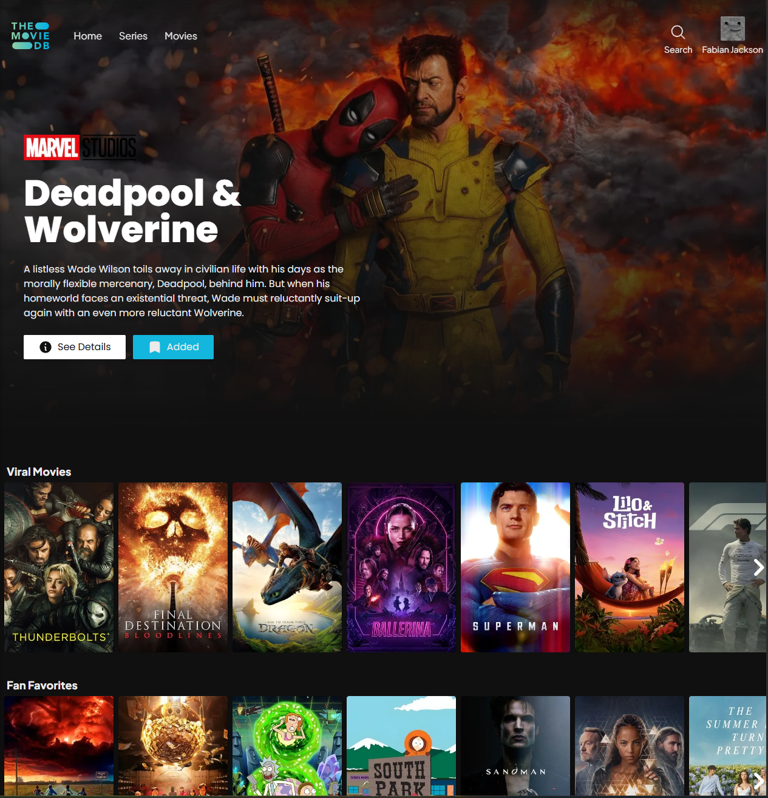
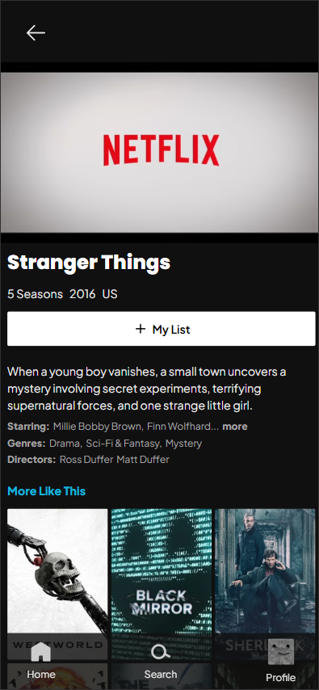
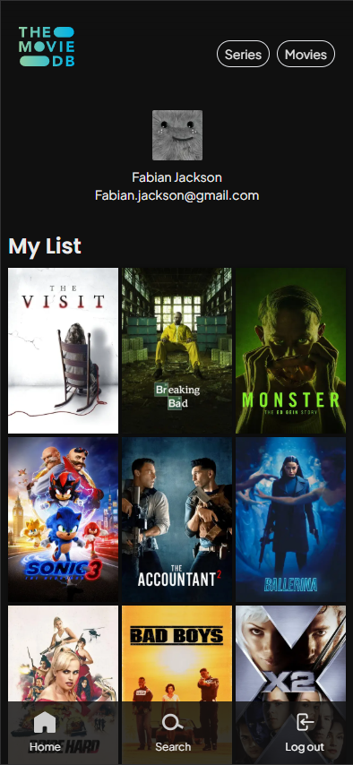

## Movie Project

Search, discover and save your favorite movies and TV shows using data from The Movie Database (TMDB).

### Features

-   **Search**: by title or actor
-   **Filter content by type**: Movies or TV Series
-   **Explore**: categories like action, adventure, science fiction, horror, etc
-   **Detailed information**: genre, cast, crew, recommendations, and collections
-   **Save favorites**: stored and displayed on your profile page

### Built With

-   
-   
-   
-   
-   
-   
-   

## Getting Started

### Prerequisites

Before you begin, make sure you have Node.js installed on your system:

-   **[Node.js](https://nodejs.org/en/download) (version 20.17)** <br>
    Node is required to run the application and manage dependencies. <br>
    You can verify your installation by running:

```bash
node -v
npm -v
```

### Installation

1. Clone the repo:

```bash
git clone https://github.com/FriceIce/movie-project.git
```

2. Navigate to project:

```bash
cd movie-project
```

3. Navigate to:

    - Client

    ```bash
        /movie-project cd client
    ```

    - Server

    ```bash
        /movie-project cd server
    ```

4. Install dependencies for:
    - Client
    ```bash
        /movie-project/client npm install
    ```
    - Server
    ```bash
    /movie-project/server npm install
    ```

### Environment Variables

Create a `.env` file inside the `/server` folder root and add the following:

| Variable                 | Description                                  |
| ------------------------ | -------------------------------------------- |
| `JWT_SECRET_KEY`         | Secret key for authentication token          |
| `JWT_REFRESH_SECRET_KEY` | Secret key for refresh token                 |
| `TMDB_API_KEY`           | The Movie Database API key                   |
| `CONNECTION_STRING`      | Connection string for your Supabase database |
| `DATABASE`               | Local database name                          |
| `USER`                   | Local database username                      |
| `HOST`                   | Local database host name                     |
| `PASSWORD`               | Local database password                      |
| `DB_PORT`                | Local database port                          |

### Database Setup

This project uses PostgreSQL for storing data. <br>

1. Create a local or cloud database.
2. Set all database connection values in the environment variables inside the `/server` folder.

```typescript
const env = process.env.NODE_ENV || 'development';
export const databaseConfig =
    env === 'production'
        ? {
              connectionString: process.env.CONNECTION_STRING,
              ssl: {
                  rejectUnauthorized: false,
              },
          }
        : {
              host: process.env.HOST || '',
              user: process.env.USER || '',
              port: Number(process.env.DB_PORT),
              password: process.env.PASSWORD || '',
              database: process.env.DATABASE || '',
          };
```

3. Run `./createTable` in `config/database` to create all tables.

```bash
npm run create-tables
```

## Usage

### Run the following commands

1. Client

```bash
/movie-project/client npm run dev
```

2. Server

```bash
/movie-project/server npm run server
```

### Desktop View



### Mobile View



